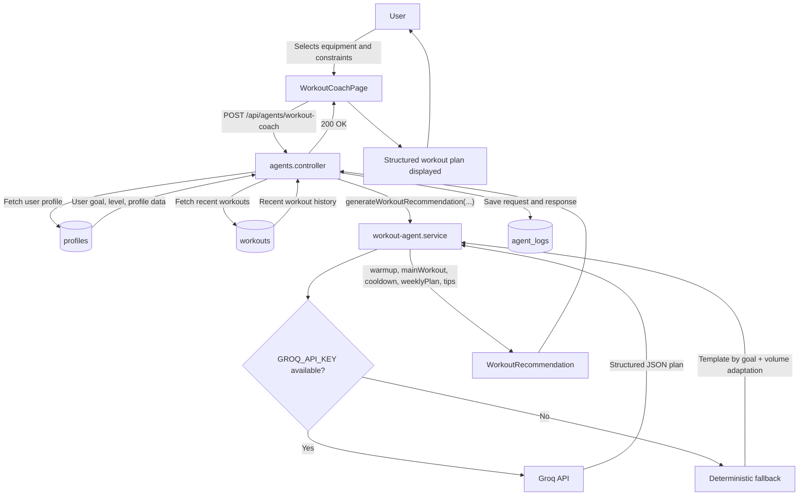
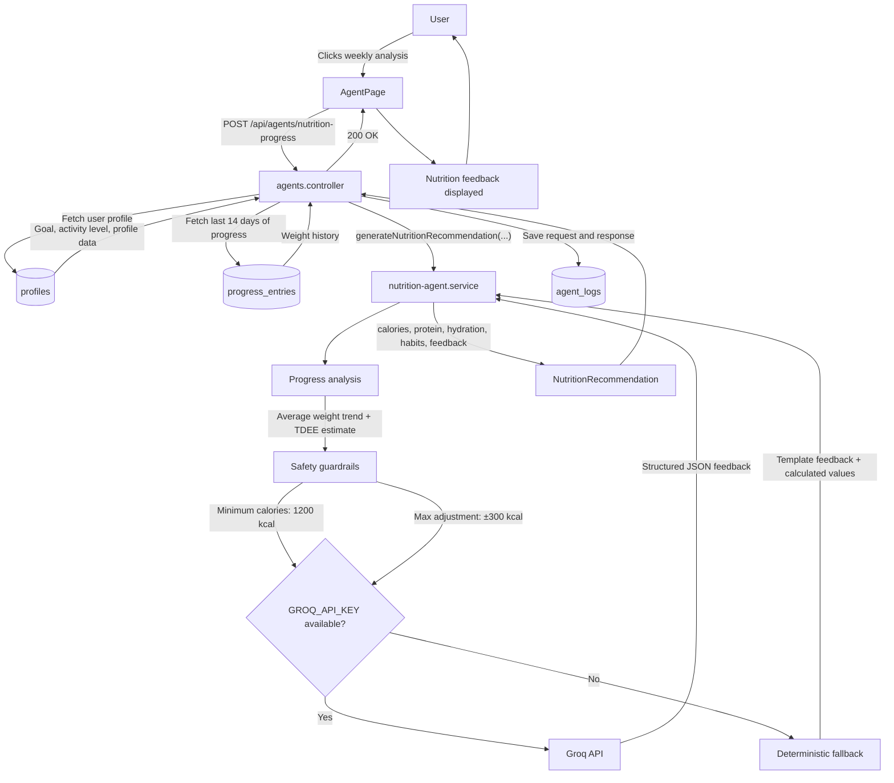
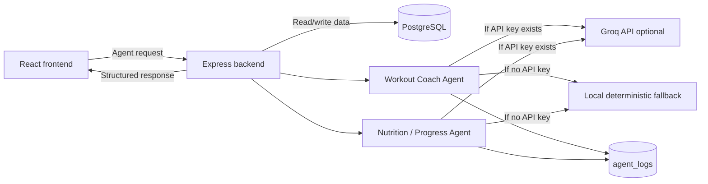

# AI Agent Workflow

This document describes the workflow of the two SmartCoach AI agents:

* **Workout Coach Agent** — generates personalized workout recommendations.
* **Nutrition / Progress Agent** — analyzes progress and generates nutrition-oriented feedback.

Both agents can use the **Groq API** when `GROQ_API_KEY` is available. If the API key is missing, the agents still work through a deterministic local fallback, which keeps the demo stable and reproducible.

---

## Agent 1 — Workout Coach Agent

### Workflow explanation

1. The user selects equipment and constraints in the workout coach page.
2. The frontend sends a request to the backend endpoint:
   `POST /api/agents/workout-coach`.
3. The backend retrieves the user profile and recent workouts from PostgreSQL.
4. The backend calls the `workout-agent.service`.
5. If `GROQ_API_KEY` exists, the agent uses Groq to generate a structured recommendation.
6. If no API key is available, the agent uses deterministic fallback logic.
7. The response is logged in `agent_logs`.
8. The frontend displays the generated workout plan.

### Main inputs

| Input               | Source        |
| ------------------- | ------------- |
| User goal           | `profiles`    |
| Fitness level       | `profiles`    |
| Available equipment | Frontend form |
| Constraints         | Frontend form |
| Recent workouts     | `workouts`    |

### Main output

The agent returns a structured workout recommendation containing:

* warmup
* main workout
* cooldown
* weekly plan
* practical tips
* generation timestamp

---

## Agent 2 — Nutrition / Progress Agent

### Workflow explanation

1. The user runs the weekly nutrition/progress analysis.
2. The frontend sends a request to the backend endpoint:
   `POST /api/agents/nutrition-progress`.
3. The backend retrieves the user profile and the latest progress entries.
4. The nutrition agent calculates recent weight trends and estimates energy needs.
5. Safety guardrails are applied before generating the recommendation.
6. If `GROQ_API_KEY` exists, the agent uses Groq to generate structured feedback.
7. If no API key is available, the deterministic fallback generates a safe local response.
8. The response is saved in `agent_logs`.
9. The frontend displays the nutrition/progress feedback.

### Main inputs

| Input                 | Source                  |
| --------------------- | ----------------------- |
| User goal             | `profiles`              |
| Activity level        | `profiles`              |
| Weight history        | `progress_entries`      |
| Recent progress trend | Calculated by service   |
| User preferences      | Profile / frontend data |

### Main output

The agent returns a structured nutrition/progress recommendation containing:

* progress feedback
* calorie guidance
* protein recommendation
* hydration recommendation
* habit suggestions
* safety notes
* generation timestamp

---

## Shared agent architecture

---

## Guardrails Summary

| Guardrail / Feature       | Workout Coach Agent         | Nutrition / Progress Agent  |
| ------------------------- | --------------------------- | --------------------------- |
| Optional Groq integration | Yes                         | Yes                         |
| Works without API key     | Yes, deterministic fallback | Yes, deterministic fallback |
| Structured output         | JSON workout plan           | JSON nutrition feedback     |
| Request/response logging  | `agent_logs`                | `agent_logs`                |
| No medical diagnosis      | Yes                         | Yes                         |
| No dangerous advice       | Yes                         | Yes                         |
| Uses user profile         | Yes                         | Yes                         |
| Uses historical data      | Recent workouts             | Progress entries            |
| Volume adaptation         | Based on activity level     | N/A                         |
| Minimum calorie rule      | N/A                         | `>= 1200 kcal/day`          |
| Calorie adjustment cap    | N/A                         | `±300 kcal`                 |
| Demo-safe behavior        | Yes                         | Yes                         |

---

## Why this design is useful for the MDS demo

The two agents are implemented as backend services, not just frontend text generators. This makes the design easier to test, evaluate and extend.

The same LLM provider key can be reused by both agents because the agents are separated by:

* different backend endpoints
* different service files
* different prompts
* different inputs
* different output structures
* different evaluation criteria

If the external API is unavailable during the presentation, the deterministic fallback keeps the application usable.
