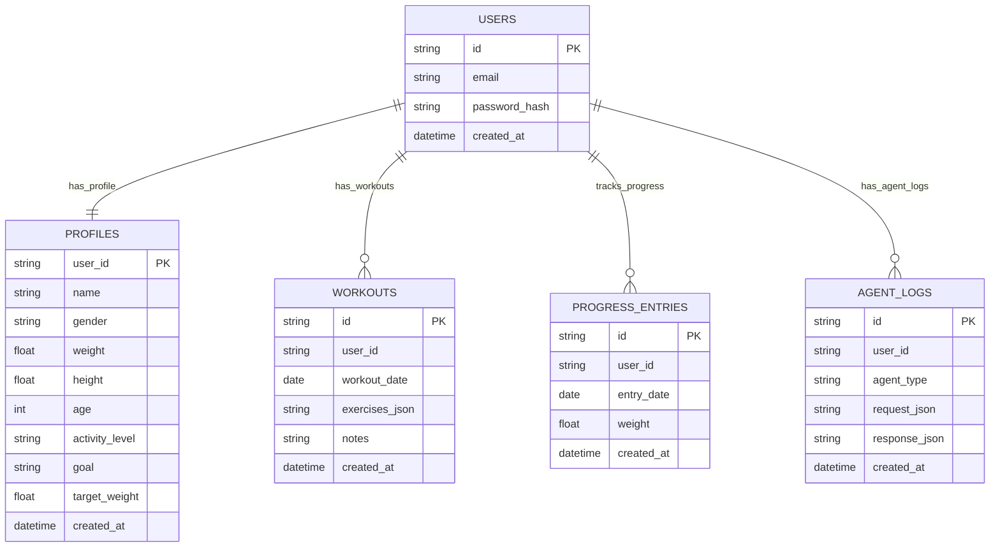
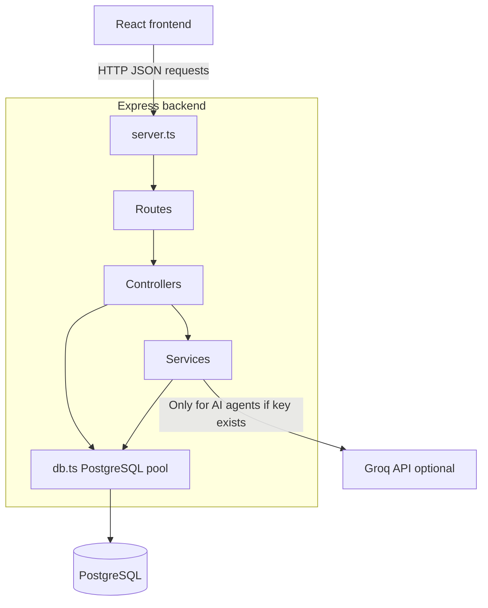
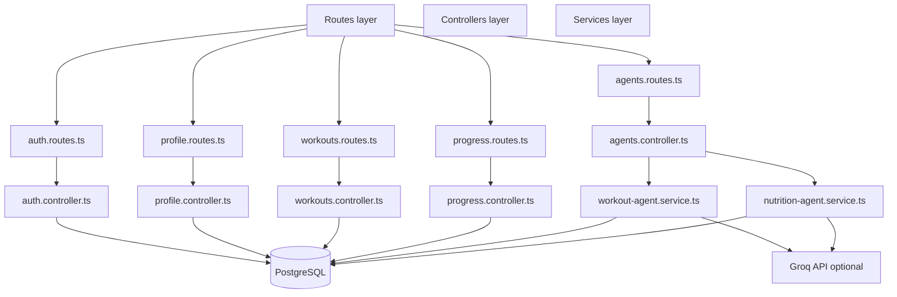
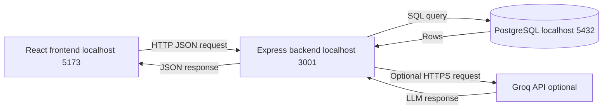
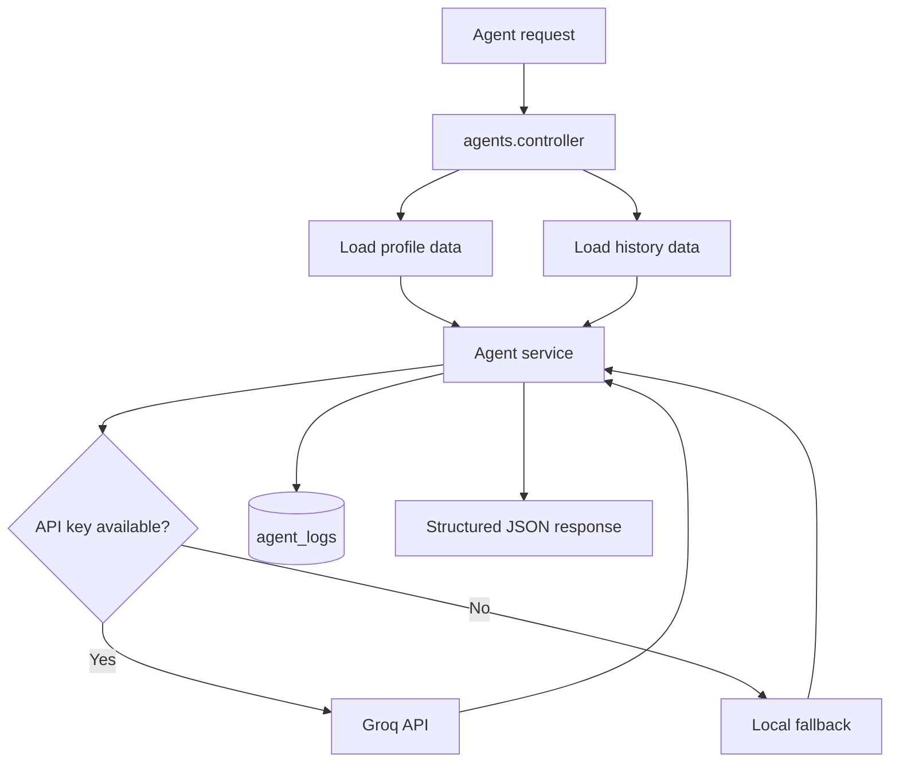

# Backend Architecture

This document describes the SmartCoach backend architecture.

The backend is built with:

* Node.js
* Express
* TypeScript
* PostgreSQL
* Optional Groq API integration for the two AI agents

---

## Database schema

### Database tables

| Table              | Purpose                                |
| ------------------ | -------------------------------------- |
| `users`            | Stores local authentication data       |
| `profiles`         | Stores user profile and fitness goal   |
| `workouts`         | Stores workout history                 |
| `progress_entries` | Stores weight tracking entries         |
| `agent_logs`       | Stores AI agent requests and responses |

---

## Backend layers

### Layer responsibilities

| Layer       | Responsibility                                 |
| ----------- | ---------------------------------------------- |
| `server.ts` | Starts Express, configures middleware and CORS |
| Routes      | Defines REST API endpoints                     |
| Controllers | Handles request and response logic             |
| Services    | Contains business logic and AI agent logic     |
| `db.ts`     | Provides the PostgreSQL connection pool        |
| PostgreSQL  | Stores application data                        |
| Groq API    | Optional external LLM provider                 |

---

## Backend modules

---

## REST API endpoints

| Method | Endpoint                         | Description                    |
| ------ | -------------------------------- | ------------------------------ |
| GET    | `/api/health`                    | Health check                   |
| POST   | `/api/auth/demo-login`           | Demo authentication            |
| POST   | `/api/auth/register`             | Create local account           |
| POST   | `/api/auth/login`                | Local login                    |
| GET    | `/api/profile/:userId`           | Get user profile               |
| PUT    | `/api/profile/:userId`           | Create or update profile       |
| GET    | `/api/workouts/:userId`          | List workout sessions          |
| POST   | `/api/workouts`                  | Create workout session         |
| PUT    | `/api/workouts/:id`              | Update workout session         |
| DELETE | `/api/workouts/:id`              | Delete workout session         |
| GET    | `/api/progress/:userId`          | List weight entries            |
| POST   | `/api/progress`                  | Add weight entry               |
| PATCH  | `/api/progress/:id`              | Update weight entry            |
| DELETE | `/api/progress/:id`              | Delete weight entry            |
| POST   | `/api/agents/workout-coach`      | Run Workout Coach Agent        |
| POST   | `/api/agents/nutrition-progress` | Run Nutrition / Progress Agent |

---

## Request and response flow

---

## AI agent backend flow

---

## Summary

The backend follows a simple layered architecture:

1. The React frontend sends HTTP requests to the Express backend.
2. The backend routes each request to a controller.
3. Controllers read and write data through PostgreSQL.
4. Agent controllers call dedicated services for AI functionality.
5. Agent services optionally call Groq when an API key exists.
6. If no API key exists, deterministic fallback logic keeps the demo working.
7. Agent requests and responses are stored in `agent_logs`.

This structure supports both the live demo and the MDS requirement for testable AI agents.