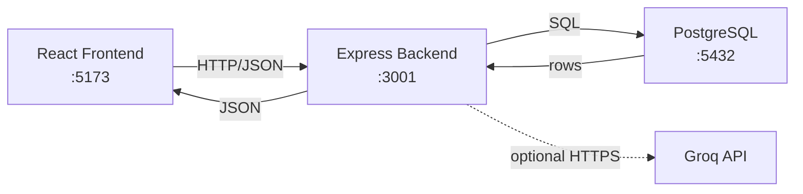

# Backend Architecture

## Database Schema (ERD)

```mermaid
erDiagram
    users {
        uuid id PK
        text email UK
        text password_hash
        timestamptz created_at
    }

    profiles {
        uuid user_id PK FK
        text name
        text gender
        numeric weight
        numeric height
        integer age
        text activity_level
        text goal
        numeric target_weight
        timestamptz created_at
    }

    workouts {
        uuid id PK
        uuid user_id FK
        date date
        jsonb exercises
        text notes
        timestamptz created_at
    }

    progress_entries {
        uuid id PK
        uuid user_id FK
        date date
        numeric weight
        timestamptz created_at
    }

    agent_logs {
        uuid id PK
        uuid user_id FK
        text agent_type
        jsonb request
        jsonb response
        timestamptz created_at
    }

    users ||--o| profiles : "has one"
    users ||--o{ workouts : "has many"
    users ||--o{ progress_entries : "has many"
    users ||--o{ agent_logs : "has many"
```

## REST API Endpoints

| Method | Endpoint | Description |
|---|---|---|
| GET | `/api/health` | Health check |
| POST | `/api/auth/demo-login` | Demo authentication |
| GET | `/api/profile/:userId` | Get user profile |
| PUT | `/api/profile/:userId` | Create or update profile |
| GET | `/api/workouts/:userId` | List workout sessions |
| POST | `/api/workouts` | Create workout session |
| PUT | `/api/workouts/:id` | Update workout session |
| DELETE | `/api/workouts/:id` | Delete workout session |
| GET | `/api/progress/:userId` | List weight entries |
| POST | `/api/progress` | Add weight entry |
| PATCH | `/api/progress/:id` | Update weight entry |
| DELETE | `/api/progress/:id` | Delete weight entry |
| POST | `/api/agents/workout-coach` | Run Workout Coach Agent |
| POST | `/api/agents/nutrition-progress` | Run Nutrition Agent |

## Request/Response Flow


