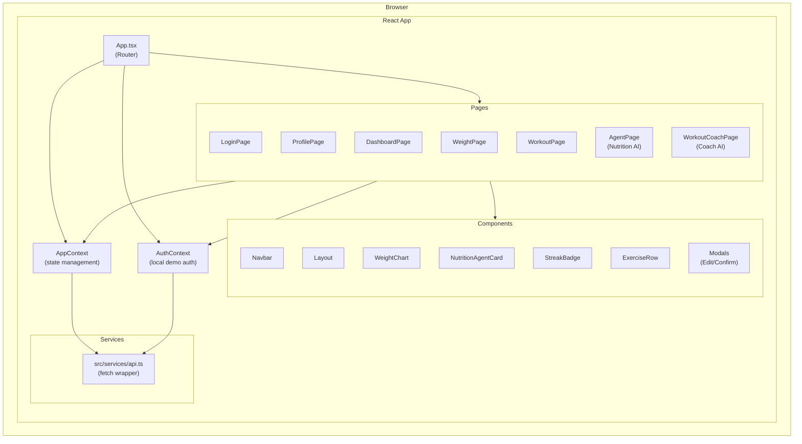
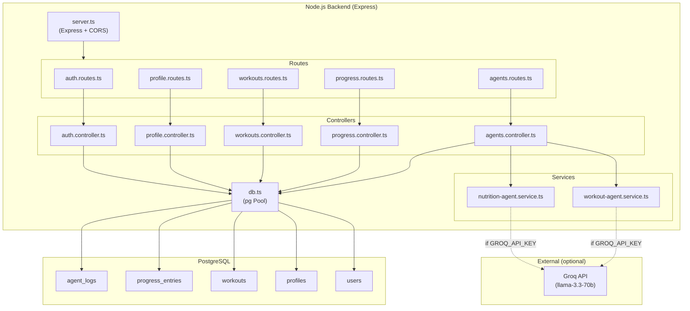

# Component Architecture

## Frontend Architecture

```mermaid
graph TB
    subgraph Browser
        subgraph React App
            App["App.tsx<br/>(Router)"]
            AuthCtx["AuthContext<br/>(local demo auth)"]
            AppCtx["AppContext<br/>(state management)"]

            subgraph Pages
                Login["LoginPage"]
                Profile["ProfilePage"]
                Dashboard["DashboardPage"]
                Weight["WeightPage"]
                Workouts["WorkoutPage"]
                Agent["AgentPage<br/>(Nutrition AI)"]
                Coach["WorkoutCoachPage<br/>(Coach AI)"]
            end

            subgraph Components
                Navbar["Navbar"]
                Layout["Layout"]
                WeightChart["WeightChart"]
                NutritionCard["NutritionAgentCard"]
                StreakBadge["StreakBadge"]
                ExerciseRow["ExerciseRow"]
                Modals["Modals<br/>(Edit/Confirm)"]
            end

            subgraph Services
                API["src/services/api.ts<br/>(fetch wrapper)"]
            end
        end
    end

    App --> AuthCtx
    App --> AppCtx
    App --> Pages
    AppCtx --> API
    AuthCtx --> API
    Pages --> Components
    Pages --> AppCtx
    Pages --> AuthCtx
```

## Backend Architecture

```mermaid
graph TB
    subgraph "Node.js Backend (Express)"
        Server["server.ts<br/>(Express + CORS)"]

        subgraph Routes
            AR["auth.routes.ts"]
            PR["profile.routes.ts"]
            WR["workouts.routes.ts"]
            PgR["progress.routes.ts"]
            AgR["agents.routes.ts"]
        end

        subgraph Controllers
            AC["auth.controller.ts"]
            PC["profile.controller.ts"]
            WC["workouts.controller.ts"]
            PgC["progress.controller.ts"]
            AgC["agents.controller.ts"]
        end

        subgraph Services
            WAS["workout-agent.service.ts"]
            NAS["nutrition-agent.service.ts"]
        end

        DB["db.ts<br/>(pg Pool)"]
    end

    subgraph "PostgreSQL"
        Users["users"]
        Profiles["profiles"]
        Workouts["workouts"]
        Progress["progress_entries"]
        Logs["agent_logs"]
    end

    subgraph "External (optional)"
        Groq["Groq API<br/>(llama-3.3-70b)"]
    end

    Server --> Routes
    AR --> AC
    PR --> PC
    WR --> WC
    PgR --> PgC
    AgR --> AgC
    AgC --> WAS
    AgC --> NAS
    WAS -.->|"if GROQ_API_KEY"| Groq
    NAS -.->|"if GROQ_API_KEY"| Groq
    AC --> DB
    PC --> DB
    WC --> DB
    PgC --> DB
    AgC --> DB
    DB --> Users
    DB --> Profiles
    DB --> Workouts
    DB --> Progress
    DB --> Logs
```
