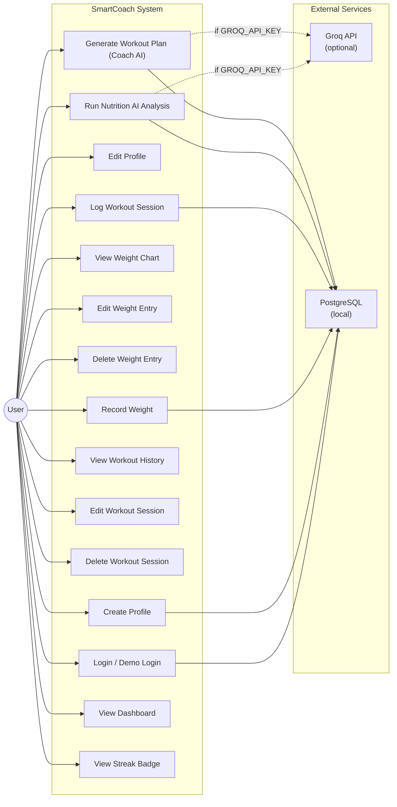

# Use Case Diagram

## Use Cases Description

| Use Case | Actor | Precondition | Postcondition |
|---|---|---|---|
| Login / Demo Login | User | App is running, backend is running | User session stored in localStorage |
| Create Profile | User | User is logged in, no profile exists | Profile saved to `profiles` table |
| Edit Profile | User | User has a profile | Profile updated in DB |
| Record Weight | User | User has a profile | Entry saved to `progress_entries` |
| View Weight Chart | User | User has ≥1 weight entry | Chart rendered with Recharts |
| Log Workout Session | User | User has a profile | Session saved to `workouts` table |
| Run Nutrition AI | User | User has a profile + ≥1 weight entry | Analysis generated, logged in `agent_logs` |
| Generate Workout Plan | User | User has a profile | Plan generated, logged in `agent_logs` |
| View Dashboard | User | User has a profile | Summary of stats, latest data, AI analysis |
